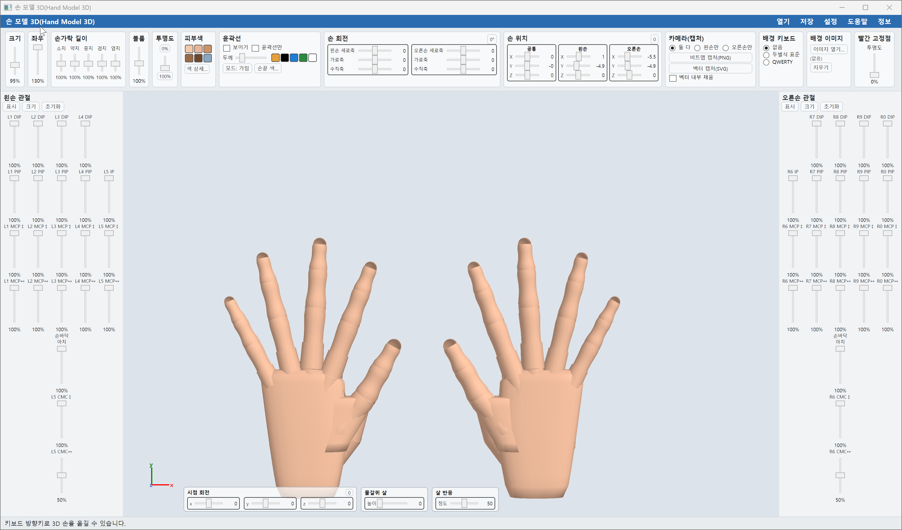
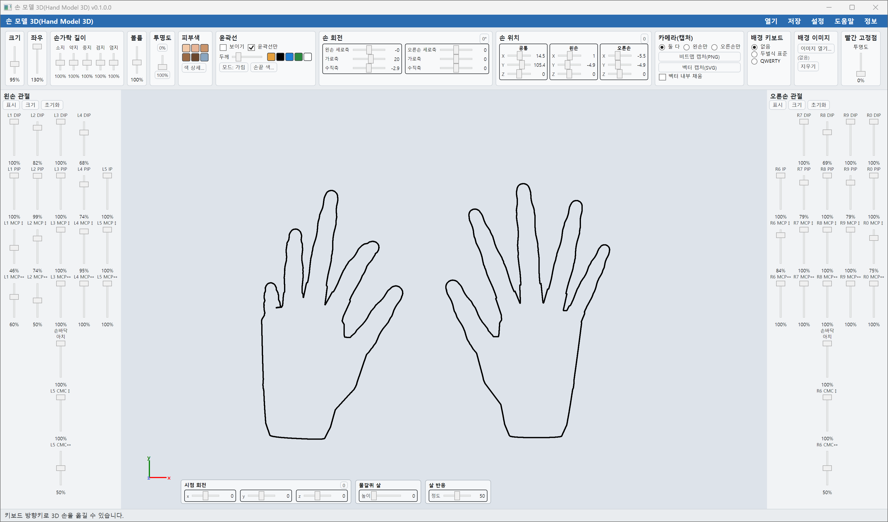
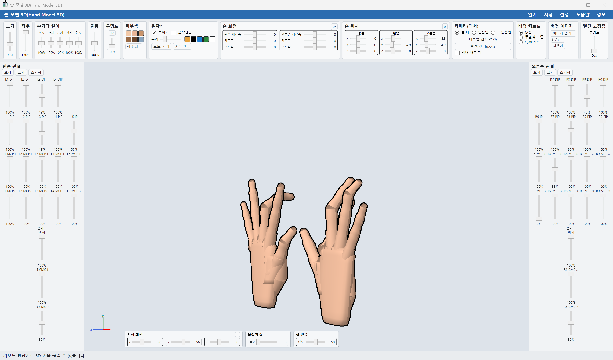
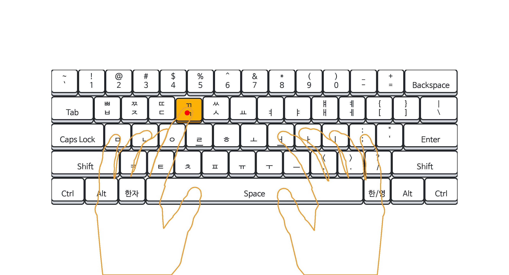
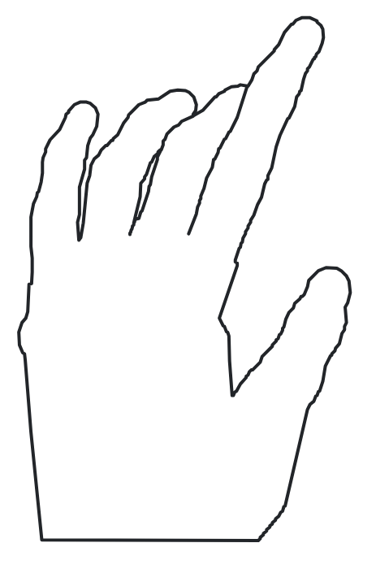

# 손 모델 3D(Hand Model 3D)

손 모델 3D는 열린타자+( https://github.com/CHBte/OpenTypingPlus )를 개발할 때 도움이 되는 보조적인 프로그램입니다.

손의 뼈/관절/근육 등의 해부학적인 특징을 반영한 3D 렌더링 프로그램입니다.

본 프로그램으로 타자하는 손 동작에 따른 다양한 손 모양 그림을 비트맵(png)과 벡터(svg) 파일로 캡처할 수 있습니다.

## 사진

### 프로그램 작동 장면

본 프로그램의 최종 목표는 손 윤곽선 그림이므로, 윤곽선만 남기는 기능이 있습니다.

각 관절의 움직임과 보는 방향 및 그림 크기 등을 제어할 수 있습니다. 또한 손가락의 길이와 볼륨도 어느 정도 조절 가능합니다.

배경으로 두벌식 표준 한글 자판을 띄운 뒤에 비트맵 캡처한 그림입니다.

          

※주의: 열린타자+(Open Typing Plus)에 손 그림을 옮길 때, 단순히 svg 그림을 옮기는 방식이 아닌 자동화된 방식이 내장돼 있습니다. 자세한 것은 "도움말"의 5장을 확인하세요.

## 기여

배경 키보드 그림은 원작자(Gear)의 소스를 포크(fork)한 코드의 일부를 수정하여 활용했습니다.

- https://github.com/suhdonghwi/OpenTyping
